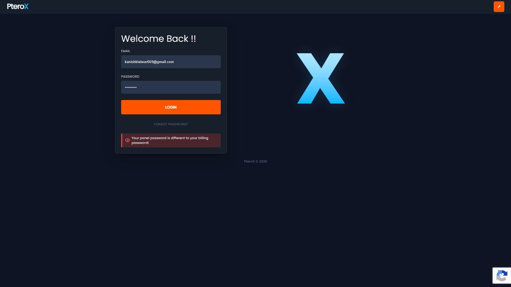
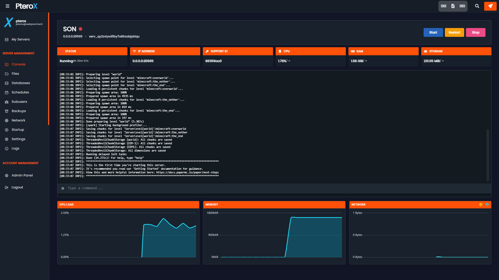

# PteroX V2 - Open Source Feel Free To Edit!

PteroX V2 is a modern frontend theme for **Pterodactyl Panel**, featuring a redesigned dark interface, custom navigation, server management UI, and configurable branding.

## ✨ Features

- 🎨 Modern dark Pterodactyl interface
- 🖥️ Redesigned server management experience
- 📁 Updated file manager UI
- 🎮 Redesigned console interface
- 👥 Subuser management
- 💾 Backups and database management
- ⚙️ Custom navigation
- 🔐 License-protected installation
- 💾 Automatic installation backups
- 🏷️ Configurable customer branding
- 🖼️ Configurable logo
- 📦 Automated installer and uninstaller
- 🎯 Pterodactyl 1.14.x support
- 🔧 Automatic frontend dependency installation

---

## 📸 Screenshots

### Login



### Server Console



---

# Compatibility

| Requirement | Version |
|---|---|
| **Pterodactyl Panel** | **1.14.x** |
| Recommended Pterodactyl | **1.14.1** |
| Node.js | Required |
| Yarn | Required |
| PHP | Required |
| Composer | Required |
| curl | Required |
| Python 3 | Required by installer |

> PteroX V2 is designed for **Pterodactyl 1.14.x**.
>
> Other Pterodactyl versions are **not guaranteed to work**.

---

# 🔑 License

PteroX V2 requires a valid license key.

The installer automatically connects to the PteroX License API and validates your license before making changes to the panel.

### Important

- Each license can only be activated once.
- Do not publicly share your license key.
- Do not publish license keys in GitHub repositories.
- Do not include license keys in screenshots.
- Do not attempt to reuse an activated license on another installation.
- Contact PteroX support if your license was activated unexpectedly.

---

# 📦 Installation

## 1. Download PteroX V2

Download the latest PteroX V2 release from the **Releases** section of this repository.

Extract the ZIP on your computer.

The package should contain:

```text
PteroX-V2/
├── files/
├── install.sh
├── uninstall.sh
├── README.md
├── checksums.txt
└── version.json
```

## 2. Upload the package

Upload the **complete `PteroX-V2` folder** to your Pterodactyl directory.

For example:

```text
cd /var/www/pterodactyl/PteroX-V2/
```
```text
Unzip The PteroX-V2-2.0.1-STABLE.zip by doing these steps 1. apt install zip -y 2. unzip PteroX-V2-2.0.1-STABLE.zip
```
```

> **Do not manually copy the contents of the `files/` folder.**
>
> The installer automatically installs the required files into your Pterodactyl installation.

## 3. Run the installer

SSH into your server and run:

```bash
cd /var/www/pterodactyl/PteroX-V2
chmod +x install.sh
sudo ./install.sh
```

The installer will ask:

```text
Enter your PteroX V2 license key:
```

Enter your valid license key.

## 4. Automatic installation

The installer automatically:

1. Checks your Pterodactyl version.
2. Requests your PteroX V2 license key.
3. Validates the license.
4. Activates the license.
5. Generates a unique installation ID.
6. Creates a timestamped backup.
7. Installs the PteroX V2 files.
8. Installs the required PteroX frontend dependencies.
9. Builds the frontend.
10. Clears Laravel caches.

PteroX V2 automatically installs:

```text
@fontsource/poppins
@fortawesome/free-brands-svg-icons
```

Customers **do not need to install these packages manually**.

If license validation fails, the installation is cancelled.

After installation, hard-refresh your browser:

```text
Ctrl + Shift + R
```

---

# 🎨 Customer Branding

PteroX V2 includes a centralized branding configuration.

After installation, edit:

```text
/var/www/pterodactyl/resources/scripts/pterox.config.ts
```

Example:

```ts
export const PTEROX_CONFIG = {
    name: 'pterox',
    email: 'pterox@webpool.tech',

    // Sidebar logo
    logo: '/images/pterox-logo.webp',

    // Header / top-left branding
    headerName: 'PteroX',
};
```

## Change the Sidebar Name

Change:

```ts
name: 'pterox',
```

to your brand:

```ts
name: 'WebPool',
```

## Change the Sidebar Email

Change:

```ts
email: 'pterox@webpool.tech',
```

to your support/company email:

```ts
email: 'support@webpool.tech',
```

## Change the Logo

Upload your logo to:

```text
/var/www/pterodactyl/public/images/
```

For example:

```text
/var/www/pterodactyl/public/images/webpool-logo.webp
```

Then change:

```ts
logo: '/images/webpool-logo.webp',
```

The configured logo is used by supported PteroX branding locations, including the sidebar and login page.

## Change the Header Branding

Change:

```ts
headerName: 'PteroX',
```

to:

```ts
headerName: 'WebPool',
```

This controls the main header and login branding.

PteroX automatically styles the final character of the configured header name as the accent color.

## Rebuild After Branding Changes

After changing the configuration:

```bash
cd /var/www/pterodactyl
yarn build:production
php artisan optimize:clear
```

Then hard-refresh your browser:

```text
Ctrl + Shift + R
```

> Normal branding changes should be made through `pterox.config.ts`.
> You normally do not need to edit the individual React components.

---

# 💾 Automatic Backups

Before installing PteroX V2, the installer creates a timestamped backup of files that will be replaced.

Backups are stored in:

```text
/var/www/pterodactyl/storage/pterox-backups/
```

Keep your backup until you have confirmed that PteroX is working correctly.

---

# 🗑️ Uninstallation

PteroX V2 includes an uninstaller that restores the most recent PteroX backup.

From the PteroX package directory:

```bash
cd /tmp/PteroX-V2
chmod +x uninstall.sh
sudo ./uninstall.sh
```

After uninstallation:

```bash
cd /var/www/pterodactyl
php artisan optimize:clear
```

Then hard-refresh your browser.

> The uninstaller restores the most recent PteroX backup created by the installer.

---

# 🛠️ Troubleshooting

## Invalid License

If you see:

```text
Invalid license key.
```

Verify that the license key was entered correctly.

If the key is correct, contact PteroX support.

## License Already Activated

If you see:

```text
License has already been activated.
```

The license has already been used.

If this was unexpected, contact PteroX support.

## License API Unavailable

If you see:

```text
Could not contact the PteroX License API.
```

Check:

- Internet connectivity
- DNS resolution
- HTTPS connectivity
- Firewall rules

Then run the installer again.

## Unsupported Pterodactyl Version

PteroX V2 requires:

```text
Pterodactyl 1.14.x
```

Do not bypass the version check.

## Frontend Build Problems

Check your installed versions:

```bash
node -v
npm -v
yarn -v
php -v
```

Then try:

```bash
cd /var/www/pterodactyl
yarn build:production
php artisan optimize:clear
```

## Branding Changes Not Showing

Run:

```bash
cd /var/www/pterodactyl
yarn build:production
php artisan optimize:clear
```

Then hard-refresh:

```text
Ctrl + Shift + R
```

---

# 🔐 Checksums

PteroX V2 includes `checksums.txt` containing SHA-256 checksums for the release files.

To verify the package:

```bash
cd /tmp/PteroX-V2
sha256sum -c checksums.txt
```

Every entry should report:

```text
OK
```

---

# 📦 Release

**Current version:** `2.0.1`

**Release:** `PteroX V2.0.1 STABLE`

Download the latest release from the **Releases** section of this repository.

### PteroX V2.0.1

This release includes:

- Fixed duplicate `Ptero` text on the login page.
- Fixed PteroX header branding colors.
- `Ptero` is displayed in white with the final accent character displayed in cyan.
- Added automatic installation of required frontend dependencies.
- Added `@fontsource/poppins` installation.
- Added `@fortawesome/free-brands-svg-icons` installation.
- Improved clean Pterodactyl 1.14.x installation compatibility.
- Updated customer documentation.
- Updated release checksums.

---

# ⚠️ Important

- PteroX V2 is designed for Pterodactyl 1.14.x.
- Keep your installation backups.
- Never publicly share license keys.
- Do not commit license keys to GitHub.
- Each license is intended for one activation.
- The installer requires access to the PteroX License API.
- PteroX V2 does not install Pterodactyl itself.
- PteroX V2 does not install Node.js, Yarn, PHP, or Composer for you.
- Future PteroX updates may overwrite custom frontend modifications.

---

# PteroX V2

**Modern Pterodactyl. Built for a cleaner experience.**
